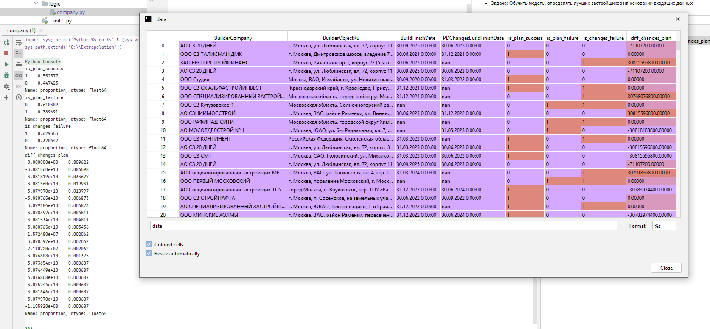

***
* ЦЕЛЬ: Определять рейтинг лучших застройщиков объектов недвижимости
***

***
* Задача: Обучить модель, определять лучших застройщиков на основании входящих данных
***

***
* Входящие данные:
  * Название компании
  * Адрес объекта строительства
  * Плановая дата сдачи объекта строительства (может быть не указана)
  * Предполагаема дата сдачи объекта строительства (может быть не указана)
***

***
* Объект исследования: компания застройщик
***

***
* Целевая переменная: is_plan_success (0/1) объект не сдан/сдан относительно текущей даты
***

***
* Другие параметры:
  * is_plan_failure: не предоставлена плановая дата сдачи (0/1) - "так себе, ЗасТройщик"
  * is_changes_failure: не предоставлена предполагаемая дата сдачи (0/1) - "так себе, ЗасТройщик"
  * diff_changes_plan: разница между предполагаемой сдачей и плановой - "пока ступор см. company.py"
***

