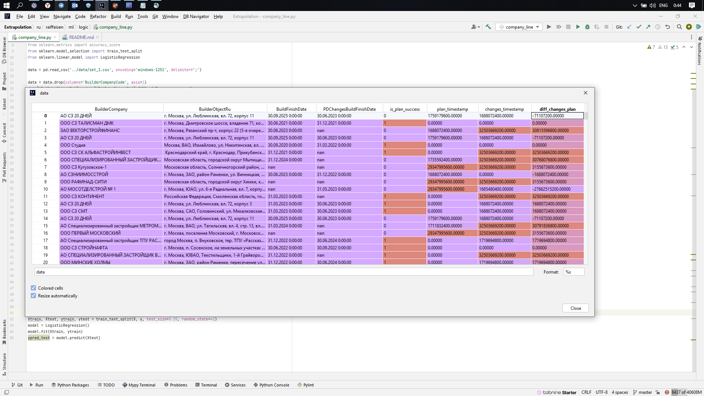

***
ВРЕМЯ, ЭТО САМЫЙ ВАЖНЫЙ ИЗ ВСЕХ ПРАКТИЧЕСКИХ СМЫСЛОВ ЖИЗНИ, ЭЛЕМЕНТ
* Научившись управлять временем, научишься управлять событиями
***

***
* Цель: Научиться управлять событиями
***

***
* Задача 1: Предсказать, буден ли сдан в срок, очередной объект застройки, или нет, или какое будет отклонение
  * Входящие данные:
    * Название компании
    * Адрес объекта строительства
    * Плановая дата сдачи объекта строительства (может быть не указана)
    * Предполагаема дата сдачи объекта строительства (может быть не указана)
  * Объект исследования: 
    * компании-застройщики и их объекты строительства
  * Целевая переменная: 
    * разница между плановой и предполагаемой сдачей объекта строительства
  * Например:
    
***