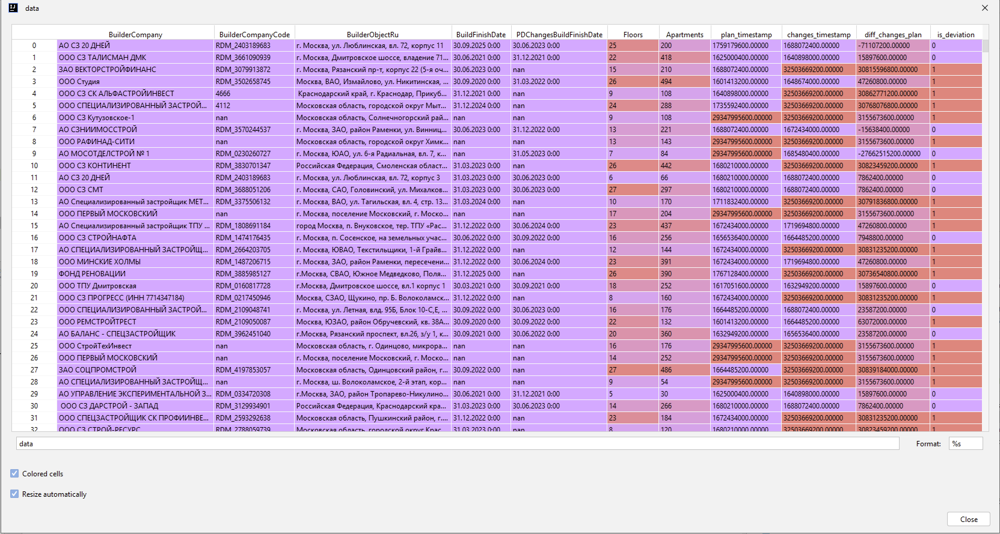
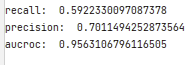

***
Цель: Определение уровеня качества застройщика для управления залоговыми рисками на первичном рынке жилья
***
* Задача 1: Предсказать вероятность отклонения от плановых сроков сдачи застройки
  * Входящие данные:
    * Название компании
    * Адрес объекта строительства
    * Плановая дата сдачи объекта строительства (может быть не указана)
    * Предполагаема дата сдачи объекта строительства (может быть не указана)
    * Количество этажей
    * Количество квартир
    * ..................
  * Объект исследования: 
    * сроки сдачи объектов строительства
  * Целевая переменная: 
    * отклонение плановой даты сдачи объекта строительства от предполагаемой более чем на год
  * Данные:
  
  
  * Логистическая регрессия при вероятности, что отклонений менее года будет > 10%
  
  
  * Градиентный бустинг
  
  

  
  * Логистическая регрессия с кодированием categorical признака при вероятности, что отклонений менее года будет > 10%
    * recall:  0.587378640776699
    * precision:  0.6994219653179191
    * aucroc:  0.9626587005227782 
  * Градиентный бустинг с кодированием categorical признака (ЧТО-ТО ПОШЛО НЕ ТАК)
    * recall:  1.0
    * precision:  1.0
    * aucroc:  1.0
  
***
